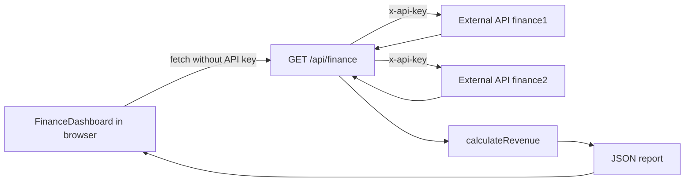
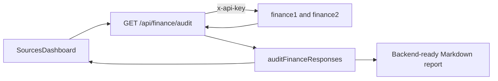

# Архитектура Finance Sources Dashboard

Этот документ описывает текущую структуру приложения, границы модулей и поток
данных. Его нужно обновлять при изменении architecture, directory structure,
public data contracts или ответственности модулей.

## Назначение приложения

Finance Sources Dashboard получает финансовые данные из двух external API,
проверяет их, рассчитывает оплаченный доход отдельно по каждой валюте и выводит
результат в двуязычном интерфейсе со светлой и тёмной темами.

Основные правила предметной области:

- в revenue входят только транзакции с `type: "paid"`;
- `pending` и `rejected` сохраняются для отображения, но не входят в итог;
- суммы разных валют не складываются друг с другом;
- данные двух источников проверяются до расчёта;
- исходные объекты и массивы не изменяются;
- `CPA_API_KEY` используется только на server side.

## Technology stack

- Next.js 16 с App Router;
- React 19;
- JavaScript ES modules;
- обычный CSS в `app/globals.css`;
- Node.js `assert` для unit tests;
- browser `fetch` для внутреннего API;
- server-side `fetch` для external finance API.

## Структура проекта

```text
home work 1/
├── app/
│   ├── api/
│   │   └── finance/
│   │       ├── audit/route.js    # Data-quality Route Handler
│   │       └── route.js          # Revenue Route Handler
│   ├── components/
│   │   ├── FinanceDashboard.js   # Revenue UI state
│   │   └── SourcesDashboard.js   # Sources and audit UI state
│   ├── sources/
│   │   └── page.js               # Страница источников
│   ├── globals.css               # Global styles и themes
│   ├── layout.js                 # Root layout и static metadata
│   └── page.js                   # Главная страница
├── docs/
│   └── ARCHITECTURE.md            # Этот документ
├── lib/
│   ├── finance-audit.js          # Non-blocking data-quality audit
│   ├── finance-sources.js        # Source registry и external requests
│   └── revenue.js                # Validation и business logic
├── reports/
│   └── finance-api-audit.md      # Текущий backend-ready report
├── skills/
│   └── audit-finance-api/        # Project skill и CLI script
├── tests/
│   ├── finance-audit.test.js     # Unit tests аудита
│   └── revenue.test.js           # Unit tests business logic
├── .code/rules/                  # Project-specific agent rules
├── AGENTS.md                     # Router для project instructions
├── CONCEPTS.md                   # Учебный разбор Next.js concepts
├── README.md                     # Запуск и краткое описание
└── package.json                  # Dependencies и npm scripts
```

Generated folders `node_modules/`, `.next/` и старый `dist/`, если он остался
после Vite, не являются частью application architecture и не редактируются
вручную.

## Ответственность модулей

### `app/layout.js`

Root layout:

- импортирует global CSS;
- задаёт static metadata страницы;
- создаёт корневые `<html>` и `<body>`;
- оборачивает все routes приложения.

Этот модуль является Server Component по умолчанию.

### `app/page.js`

Главная route `/`:

- импортирует `FinanceDashboard`;
- не содержит business logic;
- служит простой точкой композиции страницы.

Этот модуль также остаётся Server Component.

### `app/components/FinanceDashboard.js`

Главный Client Component. Директива `"use client"` нужна из-за React state,
effects, event handlers, `localStorage` и доступа к `document`.

Компонент отвечает за:

- запрос к внутреннему `/api/finance`;
- состояния `loading`, `success` и `error`;
- хранение загруженного report;
- переключение `ru`/`en`;
- переключение `light`/`dark`;
- сохранение языка и темы в `localStorage`;
- форматирование сумм через `Intl.NumberFormat`;
- отображение totals, sources, payments и всех transactions источника №1.

Он не должен получать `CPA_API_KEY` или обращаться к protected external API
напрямую.

### `app/api/finance/route.js`

Route Handler для `GET /api/finance`. Это server boundary приложения.

Он отвечает за:

- проверку наличия `CPA_API_KEY`;
- добавление header `x-api-key` к external requests;
- параллельный запрос `finance1` и `finance2` через `Promise.all`;
- проверку HTTP status каждого ответа;
- передачу данных в `calculateRevenue`;
- возврат JSON report или безопасного JSON error.

Значение API key берётся из `process.env.CPA_API_KEY` и не отправляется в
browser bundle.

### `app/sources/page.js` и `SourcesDashboard.js`

Route `/sources` показывает реестр двух внешних API, ожидаемые форматы и
результаты live-проверки. Client Component запрашивает только внутренний
`/api/finance/audit`, отображает loading/error/success states и сохраняет общие
настройки языка и темы через `localStorage`.

### `app/api/finance/audit/route.js`

Route Handler параллельно получает сырые ответы обоих источников на server side
и передает их в `auditFinanceResponses`. Он возвращает список источников и все
найденные проблемы, но никогда не отправляет API key в browser.

### `lib/finance-audit.js` и `lib/finance-sources.js`

`finance-sources.js` хранит единый реестр endpoints и функцию защищенного
server-side запроса. `finance-audit.js` собирает ошибки и предупреждения по
schema, amounts, currency case, ISO 4217 currencies и transaction types, не
изменяя входные ответы и не останавливаясь на первой проблеме.

Эти же правила вызывает CLI script навыка `audit-finance-api`, поэтому
Markdown-отчет и страница `/sources` не расходятся в критериях.

### `lib/revenue.js`

Чистый модуль business logic, не зависящий от React или Next.js.

Он отвечает за:

- проверку структуры обоих sources;
- нормализацию трёхбуквенных currency codes;
- проверку неотрицательных конечных amounts;
- разбор строк source №2 в формате `"amount CURRENCY"`;
- фильтрацию только `paid` transactions для revenue;
- сохранение копии всех transactions для interface;
- группировку сумм по currency;
- форматирование address или возврат `"N/A"`;
- формирование единого report contract.

Эта изоляция позволяет тестировать расчёты без запуска Next.js server.

### `tests/revenue.test.js`

Unit tests вызывают `calculateRevenue` напрямую и проверяют:

- отдельные итоги `USD` и `EUR`;
- исключение `pending` и `rejected` из revenue;
- сохранение полного списка transactions;
- отдельные totals каждого source;
- формат address;
- значение `N/A` для source без address;
- пустые sources.

## Поток данных



Для аудита действует параллельный поток:



Пошагово:

1. После mount `FinanceDashboard` вызывает `loadRevenue()`.
2. Browser отправляет `GET /api/finance` без secret key.
3. Route Handler читает `CPA_API_KEY` из server environment.
4. Server параллельно запрашивает оба external sources.
5. Ответы передаются в `calculateRevenue`.
6. Business logic возвращает totals и детали sources.
7. Route Handler отправляет report в формате JSON.
8. Client Component сохраняет report в state и обновляет interface.

## Data contracts

### Source №1

Ожидаемая минимальная форма:

```js
{
  transactions: [
    {
      type: "paid",
      amount: 100,
      currency: "USD",
    },
  ],
  address: {
    city: "New York",
    street: "5th Avenue",
    houseNumber: 10,
  },
}
```

`address` может отсутствовать. В таком случае report содержит `"N/A"`.

### Source №2

Ожидается массив строк:

```js
["300 USD", "200 EUR"]
```

Каждая строка должна содержать неотрицательное число и трёхбуквенный currency
code, разделённые пробелом.

### Internal report

`calculateRevenue` возвращает:

```js
{
  totalsByCurrency: {
    USD: 400,
    EUR: 430,
  },
  source1: {
    address: "10, 5th Avenue, New York",
    transactions: [],
    payments: [],
    totalsByCurrency: {},
  },
  source2: {
    address: "N/A",
    payments: [],
    totalsByCurrency: {},
  },
}
```

`totalsByCurrency` является основным механизмом защиты от смешивания валют.

## State management

Глобальная state library не используется. State локален для
`FinanceDashboard`:

- `language` — выбранный язык;
- `theme` — выбранная тема;
- `report` — последний успешно полученный отчёт или `null`;
- `status` — тип и текст состояния запроса.

`language` и `theme` сохраняются в `localStorage`. Финансовый report не
сохраняется и загружается заново при открытии или по кнопке refresh.

## Error handling

Ошибки проходят через два уровня:

1. Server Route Handler обрабатывает отсутствие API key, non-2xx external
   response, invalid data и network failures.
2. Client Component обрабатывает non-2xx internal response и показывает
   сообщение в `aria-live` status element.

При client error предыдущий report очищается, чтобы interface не показывал
устаревшие данные как актуальные.

## Security boundaries

- `CPA_API_KEY` разрешено использовать только в server code.
- Client Component не должен импортировать server-only configuration.
- External API должен вызываться через Route Handler.
- Secrets нельзя помещать в `NEXT_PUBLIC_*`, source code, logs или Git.
- External data считается недоверенным и проверяется в `lib/revenue.js`.
- Public error messages не должны раскрывать secret values.

## Styling and localization

`app/globals.css` содержит visual system, responsive rules и обе themes.
Активная theme записывается в `document.documentElement.dataset.theme`.

Все UI strings хранятся в объекте `translations` внутри
`FinanceDashboard.js`. Currency codes и API fields не переводятся. Денежные
значения форматируются через `Intl.NumberFormat` с locale `ru-RU` или `en-US`.

## Verification commands

После изменения business logic:

```bash
npm test
```

После изменения architecture, routes, Client/Server boundary, imports или
metadata:

```bash
npm test
npm run build
```

Для ручной проверки interface:

```bash
npm run dev
```

Затем открыть `http://localhost:3000` и проверить loading, success, error,
language switch и обе themes.

## Правила архитектурных изменений

При добавлении новой функции:

- UI и browser interactions размещать в Client Components;
- secrets и protected external requests оставлять на server side;
- расчёты и validation держать в независимых модулях `lib/`;
- не смешивать разные currencies без явного conversion layer и актуального
  exchange rate;
- добавлять tests для изменившейся business logic;
- обновлять этот документ, если меняются module boundaries, routes, data flow,
  data contracts или основные dependencies.
